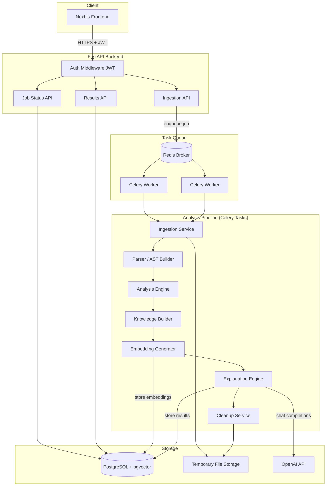
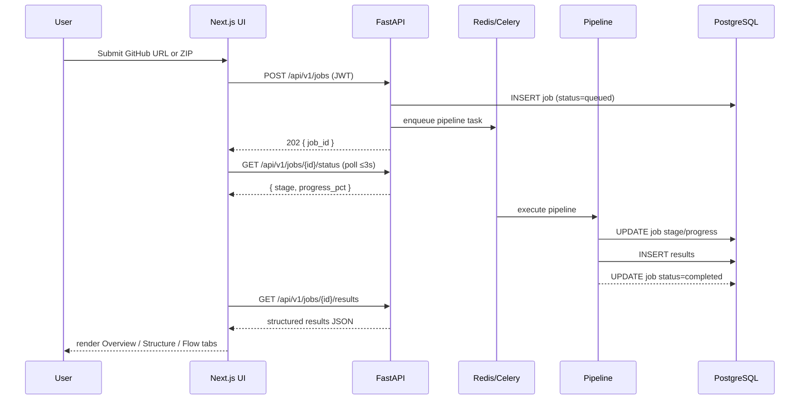

# Design Document: VibeAnalytix

## Overview

VibeAnalytix is a deliberate AI-powered code understanding engine. It accepts a GitHub repository URL or ZIP file upload, runs a multi-pass analysis pipeline, builds hierarchical knowledge, and produces structured beginner-friendly explanations rendered in an interactive Next.js UI.

The system is designed around a **delayed-response intelligence model**: no explanation is generated until the full analysis pipeline has completed. This ensures explanations are grounded in complete codebase context rather than partial information.

### Key Design Principles

- **Deliberate reasoning over instant response** — multi-pass analysis before any AI generation
- **Asynchronous by default** — all heavy processing runs in Celery workers; the API is non-blocking
- **Hierarchical context** — understanding is built bottom-up: function → file → module → project
- **Semantic retrieval** — pgvector embeddings enable context-aware explanation generation
- **Security-first ingestion** — all user-supplied code runs in read-only sandboxed environments

---

## Architecture

### High-Level System Diagram



### Request Lifecycle



---

## Components and Interfaces

### 1. Ingestion Service

Responsible for accepting, validating, and materializing the user's codebase into a temporary isolated directory.

**GitHub URL path:**
- Validate URL format (HTTPS, github.com domain only)
- Shallow-clone via `git clone --depth 1`
- Enforce 500 MB size limit post-clone
- Reject SSH or non-GitHub URLs

**ZIP upload path:**
- Validate `.zip` extension and ZIP magic bytes (`PK\x03\x04`)
- Enforce 100 MB size limit pre-extraction
- Extract with path sanitization (strip `../` sequences, resolve to temp dir)
- Reject archives containing executable binaries (`.exe`, `.dll`, `.so`, `.bin`)

**Interface:**
```python
class IngestionResult:
    job_id: str
    temp_dir: Path
    source_type: Literal["github", "zip"]
    repo_size_bytes: int

async def ingest_github(job_id: str, url: str) -> IngestionResult: ...
async def ingest_zip(job_id: str, file_bytes: bytes) -> IngestionResult: ...
```

### 2. Parser

Detects languages and builds AST representations using tree-sitter.

**Responsibilities:**
- Detect language per file (extension + content heuristics)
- Generate tree-sitter AST for each supported file
- Extract: function defs, class defs, imports/exports, top-level variable declarations
- Serialize AST back to normalized source (Pretty_Printer) for round-trip validation
- Log and skip files that fail parsing; continue with remaining files

**Supported languages:** Python, JavaScript, TypeScript, Java, Go, C, C++

**Interface:**
```python
@dataclass
class ParsedFile:
    path: str
    language: str
    ast: tree_sitter.Node
    functions: list[FunctionDef]
    classes: list[ClassDef]
    imports: list[ImportDef]
    top_level_vars: list[VarDef]
    parse_error: str | None

def parse_repository(temp_dir: Path) -> list[ParsedFile]: ...
def pretty_print(ast: tree_sitter.Node, language: str) -> str: ...
```

### 3. Analysis Engine

Performs three sequential passes over the parsed file set.

**Pass 1 — Structural Mapping:**
- Build hierarchical file/directory tree
- Identify entry point files by language convention

**Pass 2 — Dependency Detection:**
- Build directed dependency graph from import/require statements
- Detect circular dependencies (DFS cycle detection)
- Catalog external library dependencies

**Pass 3 — Context Refinement:**
- Resolve cross-file semantic relationships
- Annotate functions with their callers/callees across files
- Enrich the dependency graph with semantic edges

**Interface:**
```python
@dataclass
class AnalysisResult:
    file_tree: FileTreeNode
    entry_points: list[str]
    dependency_graph: dict[str, list[str]]
    circular_deps: list[list[str]]
    external_deps: list[str]
    cross_file_relations: list[CrossFileRelation]

def run_analysis(parsed_files: list[ParsedFile]) -> AnalysisResult: ...
```

### 4. Knowledge Builder

Constructs hierarchical summaries and generates embeddings.

**Summarization hierarchy:**
1. Function-level: one summary per function/method (chunk at 200-line boundary)
2. File-level: aggregate function summaries → file summary
3. Module-level: aggregate file summaries per directory → module summary
4. Project-level: aggregate module summaries → single project summary

**Embedding generation:**
- Call OpenAI embeddings API (`text-embedding-3-small`) per function summary
- Store embedding vector + metadata in PostgreSQL/pgvector

**Interface:**
```python
@dataclass
class KnowledgeGraph:
    function_summaries: list[FunctionSummary]
    file_summaries: list[FileSummary]
    module_summaries: list[ModuleSummary]
    project_summary: ProjectSummary

async def build_knowledge(
    parsed_files: list[ParsedFile],
    analysis: AnalysisResult,
) -> KnowledgeGraph: ...

async def generate_and_store_embeddings(
    job_id: str,
    knowledge: KnowledgeGraph,
    db: AsyncSession,
) -> None: ...
```

### 5. Explanation Engine

Generates structured explanations using OpenAI chat completions with semantic context retrieval.

**For each explanation type:**
1. Retrieve top-10 semantically similar embeddings via pgvector cosine similarity
2. Construct prompt with retrieved context + hierarchical summaries
3. Call `gpt-4o` with structured output schema
4. Retry up to 3 times with exponential backoff on API errors

**Explanation types produced:**
- Project overview (purpose, architecture, key technologies)
- Per-file explanation (role, key functions, relationships)
- Execution flow (start → process → output narrative)

**Interface:**
```python
async def generate_explanations(
    job_id: str,
    knowledge: KnowledgeGraph,
    db: AsyncSession,
) -> ExplanationSet: ...
```

### 6. Cleanup Service

Deletes temporary files after job completion or failure.

- Triggered at job terminal state (completed/failed)
- Enforces 10-minute SLA for deletion
- Marks jobs stuck in `in_progress` > 30 minutes as `failed` (timeout watchdog)
- Logs: job_id, timestamp, bytes_freed
- Each Job runs within a resource-constrained environment enforcing CPU and memory limits via cgroups (or Docker resource constraints), preventing any single Job from starving other workers

### 7. FastAPI Backend

REST API layer with JWT authentication middleware.

**Endpoints:**

| Method | Path | Description |
|--------|------|-------------|
| POST | `/api/v1/auth/register` | Register new user |
| POST | `/api/v1/auth/login` | Issue JWT |
| POST | `/api/v1/jobs` | Submit GitHub URL or ZIP |
| GET | `/api/v1/jobs/{job_id}/status` | Poll job stage + progress |
| GET | `/api/v1/jobs/{job_id}/results` | Fetch completed results |
| POST | `/api/v1/jobs/{job_id}/retry` | Retry a failed job |

**API versioning:** All endpoints are prefixed with `/api/v1/` to allow backward-compatible evolution (e.g., `/api/v1/jobs`, `/api/v1/auth/login`).

**Rate limiting:** 10 job submissions per user per hour (enforced via Redis sliding window).

**Idempotency:** Job submission endpoints (`POST /api/v1/jobs`) accept an optional `Idempotency-Key` header. Duplicate submissions with the same key within a 24-hour window return the existing job record instead of creating a new one, preventing duplicate processing on client retries.

### 8. Next.js Frontend

Interactive UI with three result tabs.

**Pages:**
- `/` — submission form (GitHub URL or ZIP upload)
- `/jobs/[id]` — job progress + results viewer

**Result tabs:**
- **Overview** — project summary, key technologies, architecture narrative
- **Structure** — file/folder tree (left panel) + per-file explanation (right panel)
- **Flow** — execution flow narrative with entry point highlighting

**Polling:** status endpoint polled every 3 seconds while job is in progress; stops on terminal state.

**Progressive rendering:** Overview tab renders as soon as project summary is available, before full job completion.

---

## Data Models

### PostgreSQL Schema

```sql
-- Users
CREATE TABLE users (
    id          UUID PRIMARY KEY DEFAULT gen_random_uuid(),
    email       TEXT UNIQUE NOT NULL,
    password_hash TEXT NOT NULL,
    created_at  TIMESTAMPTZ DEFAULT now()
);

-- Jobs
CREATE TABLE jobs (
    id          UUID PRIMARY KEY DEFAULT gen_random_uuid(),
    user_id     UUID NOT NULL REFERENCES users(id),
    source_type TEXT NOT NULL CHECK (source_type IN ('github', 'zip')),
    source_ref  TEXT NOT NULL,          -- URL or original filename
    status      TEXT NOT NULL DEFAULT 'queued'
                    CHECK (status IN ('queued','in_progress','completed','failed')),
    current_stage TEXT,                 -- e.g. 'parsing', 'analysis', 'embedding'
    progress_pct  INT DEFAULT 0,
    error_message TEXT,
    created_at  TIMESTAMPTZ DEFAULT now(),
    updated_at  TIMESTAMPTZ DEFAULT now()
);

-- Parsed file metadata
CREATE TABLE parsed_files (
    id          UUID PRIMARY KEY DEFAULT gen_random_uuid(),
    job_id      UUID NOT NULL REFERENCES jobs(id) ON DELETE CASCADE,
    file_path   TEXT NOT NULL,
    language    TEXT,
    parse_error TEXT
);

-- Function-level summaries + embeddings
CREATE TABLE function_summaries (
    id              UUID PRIMARY KEY DEFAULT gen_random_uuid(),
    job_id          UUID NOT NULL REFERENCES jobs(id) ON DELETE CASCADE,
    file_path       TEXT NOT NULL,
    function_name   TEXT NOT NULL,
    line_start      INT,
    line_end        INT,
    summary_text    TEXT,
    embedding       vector(1536)        -- OpenAI text-embedding-3-small dimension
);

CREATE INDEX ON function_summaries
    USING ivfflat (embedding vector_cosine_ops) WITH (lists = 100);

-- File-level summaries
CREATE TABLE file_summaries (
    id          UUID PRIMARY KEY DEFAULT gen_random_uuid(),
    job_id      UUID NOT NULL REFERENCES jobs(id) ON DELETE CASCADE,
    file_path   TEXT NOT NULL,
    summary_text TEXT
);

-- Module-level summaries
CREATE TABLE module_summaries (
    id          UUID PRIMARY KEY DEFAULT gen_random_uuid(),
    job_id      UUID NOT NULL REFERENCES jobs(id) ON DELETE CASCADE,
    module_path TEXT NOT NULL,          -- directory path
    summary_text TEXT
);

-- Project-level results
CREATE TABLE project_results (
    id              UUID PRIMARY KEY DEFAULT gen_random_uuid(),
    job_id          UUID UNIQUE NOT NULL REFERENCES jobs(id) ON DELETE CASCADE,
    project_summary TEXT,
    overview_explanation TEXT,
    flow_explanation TEXT,
    dependency_graph JSONB,
    entry_points    JSONB,
    circular_deps   JSONB,
    external_deps   JSONB,
    file_tree       JSONB
);
```

### Key Application Data Structures

```python
@dataclass
class FunctionDef:
    name: str
    line_start: int
    line_end: int
    parameters: list[str]
    docstring: str | None

@dataclass
class FileTreeNode:
    name: str
    path: str
    is_dir: bool
    children: list["FileTreeNode"]

@dataclass
class JobStatus:
    job_id: str
    status: Literal["queued", "in_progress", "completed", "failed"]
    current_stage: str | None
    progress_pct: int
    error_message: str | None

@dataclass
class ExplanationSet:
    overview: str
    per_file: dict[str, str]   # file_path -> explanation
    flow: str
```

### Pipeline Stage → Progress Mapping

| Stage | progress_pct |
|-------|-------------|
| queued | 0 |
| ingestion | 5–15 |
| parsing | 15–30 |
| analysis_pass1 | 30–40 |
| analysis_pass2 | 40–50 |
| analysis_pass3 | 50–60 |
| knowledge_building | 60–70 |
| embedding | 70–80 |
| explanation | 80–95 |
| cleanup | 95–100 |
| completed | 100 |

---

## Correctness Properties

*A property is a characteristic or behavior that should hold true across all valid executions of a system — essentially, a formal statement about what the system should do. Properties serve as the bridge between human-readable specifications and machine-verifiable correctness guarantees.*

### Property 1: Invalid URL Rejection

*For any* URL that is malformed, uses SSH format, or does not point to a github.com HTTPS endpoint, the Ingestion_Service should return an error and not create a temporary directory.

**Validates: Requirements 1.2, 1.4**

---

### Property 2: ZIP Path Traversal Containment

*For any* ZIP archive containing entries with path traversal sequences (e.g., `../`, absolute paths), all extracted files should reside within the designated temporary directory and no file should be written outside it.

**Validates: Requirements 2.4**

---

### Property 3: Invalid ZIP Rejection

*For any* byte sequence that does not begin with the ZIP magic bytes (`PK\x03\x04`) or does not have a `.zip` extension, the Ingestion_Service should reject the input and return an error without extracting any files.

**Validates: Requirements 2.2, 12.1**

---

### Property 4: Language Detection Accuracy

*For any* source file with a known programming language (Python, JavaScript, TypeScript, Java, Go, C, C++), the Parser should detect the correct language.

**Validates: Requirements 3.1, 3.4**

---

### Property 5: File Tree Completeness

*For any* directory structure on disk, the Parser's file structure map should contain exactly the same set of file paths and directory paths as the actual filesystem tree.

**Validates: Requirements 3.2**

---

### Property 6: Parser Resilience

*For any* collection of source files where some are invalid or unsupported, the Parser should return successful parse results for all valid files and error records for the invalid ones, without aborting the entire batch.

**Validates: Requirements 3.3, 4.2**

---

### Property 7: AST Extraction Completeness

*For any* valid source file in a supported language, the Parser should extract all function definitions, class definitions, import/export statements, and top-level variable declarations present in that file.

**Validates: Requirements 4.1, 4.3**

---

### Property 8: AST Round-Trip

*For any* valid source file in a supported language, parsing the file to an AST, printing the AST back to source via the Pretty_Printer, and then parsing again should produce an equivalent AST (same structure and extracted constructs).

**Validates: Requirements 4.4, 4.5**

---

### Property 9: Dependency Graph Completeness

*For any* set of source files with known import relationships, the Analysis_Engine's dependency graph should contain an edge for every import/require relationship present in the source files.

**Validates: Requirements 5.2**

---

### Property 10: Circular Dependency Detection

*For any* dependency graph that contains a cycle, the Analysis_Engine should include that cycle in the analysis output.

**Validates: Requirements 5.3**

---

### Property 11: External Dependency Completeness

*For any* set of source files with known external library imports, all external dependencies should appear in the Analysis_Engine's external deps list.

**Validates: Requirements 5.4**

---

### Property 12: Knowledge Hierarchy Completeness

*For any* set of parsed files, the Knowledge_Builder should produce: a function summary for every extracted function, a file summary for every source file, a module summary for every directory containing source files, and exactly one project summary.

**Validates: Requirements 6.1, 6.2, 6.3, 6.4**

---

### Property 13: Function Chunking Bound

*For any* function body with more than 200 lines, the Knowledge_Builder should split it into chunks where every chunk contains at most 200 lines.

**Validates: Requirements 6.5**

---

### Property 14: Embedding Storage Round-Trip

*For any* function summary, after the Knowledge_Builder generates and stores its embedding, querying the database by job_id and function_name should return the same embedding vector along with the correct file_path, function_name, and line range metadata.

**Validates: Requirements 7.1, 7.2**

---

### Property 15: Semantic Retrieval Count

*For any* query embedding and a database containing N function embeddings (N ≥ 10), the Explanation_Engine's context retrieval should return exactly 10 results ordered by descending cosine similarity.

**Validates: Requirements 7.3**

---

### Property 16: Per-File Explanation Completeness

*For any* set of source files processed by the Explanation_Engine, every source file should have a corresponding non-empty explanation in the result set.

**Validates: Requirements 8.2**

---

### Property 17: OpenAI Retry Behavior

*For any* OpenAI API call that fails, the Explanation_Engine should retry the request exactly 3 times before marking the job as failed, with each retry delay being greater than the previous (exponential backoff).

**Validates: Requirements 8.5**

---

### Property 18: Job Creation Returns ID

*For any* valid job submission (GitHub URL or ZIP), the system should create a job record in the database and return a job_id in the response.

**Validates: Requirements 9.1**

---

### Property 19: Job Status Response Shape

*For any* job that is in progress, the status endpoint should return a response containing a non-null `current_stage` field and a `progress_pct` value between 0 and 100 inclusive.

**Validates: Requirements 9.3**

---

### Property 20: Job Terminal State Correctness

*For any* job that completes the full pipeline without error, its status should be "completed". For any job that encounters an unrecoverable error at any stage, its status should be "failed" and `error_message` should be non-empty.

**Validates: Requirements 9.4, 9.5**

---

### Property 21: Job Isolation

*For any* set of concurrently running jobs where one job fails, the remaining jobs should continue processing and reach their terminal states independently.

**Validates: Requirements 9.7**

---

### Property 22: Polling Interval Bound

*For any* in-progress job displayed in the UI, the interval between consecutive status endpoint polls should be at least 3 seconds.

**Validates: Requirements 10.4**

---

### Property 23: Progressive Rendering

*For any* job where the project summary is available but per-file explanations are not yet complete, the Overview tab should render the project summary without waiting for full job completion.

**Validates: Requirements 10.6**

---

### Property 24: Authentication Enforcement

*For any* request to a protected endpoint that does not include a valid JWT, the system should return HTTP 401.

**Validates: Requirements 11.1, 11.2**

---

### Property 25: Authorization Enforcement

*For any* authenticated user A requesting results for a job owned by user B (A ≠ B), the system should return HTTP 403.

**Validates: Requirements 11.3**

---

### Property 26: JWT Expiry

*For any* JWT token with an issuance time more than 24 hours in the past, the system should reject it and return HTTP 401.

**Validates: Requirements 11.4**

---

### Property 27: Rate Limit Enforcement

*For any* user who has submitted 10 jobs within the current hour, the 11th submission attempt should be rejected with an appropriate error response.

**Validates: Requirements 12.2**

---

### Property 28: Executable Binary Rejection

*For any* repository or ZIP archive containing files with extensions `.exe`, `.dll`, `.so`, or `.bin`, the Ingestion_Service should reject the input and return an error.

**Validates: Requirements 12.4**

---

### Property 29: Cleanup After Terminal State

*For any* job that reaches "completed" or "failed" status, the Cleanup_Service should delete all temporary files associated with that job such that the temp directory no longer exists.

**Validates: Requirements 13.1**

---

### Property 30: Timeout Watchdog

*For any* job that has been in "in_progress" status for more than 30 minutes, the Cleanup_Service should transition it to "failed" status with a timeout error message.

**Validates: Requirements 13.2**

---

## Error Handling

### Ingestion Errors

| Error | Behavior |
|-------|----------|
| Malformed/non-GitHub URL | Return 400 with descriptive message; no job created |
| Repository > 500 MB | Return 400 with size limit message; delete partial clone |
| Non-ZIP file upload | Return 400 with format error; no extraction |
| ZIP > 100 MB | Return 400 with size limit message |
| Path traversal in ZIP | Sanitize paths; log warning; continue extraction safely |
| Executable binary in archive | Return 400; delete extracted files |
| Git clone failure (network) | Return 500; mark job failed; cleanup |

### Parser Errors

- Per-file parse failures are logged and skipped; the pipeline continues
- If > 80% of files fail to parse, the job is marked failed with a diagnostic message
- Unsupported language files are silently skipped (not counted as errors)

### Analysis Errors

- Circular dependency detection failures are non-fatal; recorded in output
- If the dependency graph cannot be built (e.g., all files failed parsing), the job is marked failed

### Knowledge Builder / Embedding Errors

- OpenAI embeddings API errors: retry up to 3 times with exponential backoff (1s, 2s, 4s)
- If embeddings fail for a function after retries, that function is skipped; a warning is recorded
- If > 50% of functions fail embedding, the job is marked failed

### Explanation Engine Errors

- OpenAI chat API errors: retry up to 3 times with exponential backoff
- After 3 failed retries, the job is marked failed with the API error message stored
- Partial explanations (some files explained, others not) are stored; the UI renders available results

### Job Timeout

- Jobs stuck in `in_progress` > 30 minutes are marked failed by the Cleanup_Service watchdog
- Watchdog runs every 5 minutes via a Celery beat schedule

### HTTP Error Responses

All API errors follow a consistent envelope:
```json
{
  "error": {
    "code": "INVALID_URL",
    "message": "Only HTTPS GitHub URLs are supported.",
    "details": {}
  }
}
```

---

## Testing Strategy

### Dual Testing Approach

Both unit tests and property-based tests are required. They are complementary:
- **Unit tests** verify specific examples, integration points, and edge cases
- **Property-based tests** verify universal correctness across many generated inputs

### Property-Based Testing

**Library:** [Hypothesis](https://hypothesis.readthedocs.io/) (Python) for backend; [fast-check](https://fast-check.dev/) (TypeScript) for frontend.

**Configuration:** Each property test must run a minimum of 100 iterations (`@settings(max_examples=100)`).

**Tagging:** Every property test must include a comment referencing the design property:
```python
# Feature: vibeanalytix, Property 8: AST Round-Trip
@given(source_file=st.from_regex(PYTHON_SOURCE_PATTERN))
def test_ast_round_trip(source_file): ...
```

**Each correctness property (1–30) must be implemented by exactly one property-based test.**

### Unit Tests

Unit tests should focus on:
- Specific language parsing examples (one per supported language — Req 3.4)
- Job creation response shape (Req 9.1)
- Three-tab UI rendering with completed job data (Req 10.1, 10.2)
- Failed job UI rendering with error message and retry button (Req 10.5)
- File selection → explanation display (Req 10.3)
- Project overview and flow explanation existence (Req 8.1, 8.3)

### Test Organization

```
tests/
  unit/
    test_ingestion.py
    test_parser.py
    test_analysis.py
    test_knowledge_builder.py
    test_explanation_engine.py
    test_cleanup.py
    test_api_auth.py
  property/
    test_ingestion_props.py      # Properties 1-3, 28
    test_parser_props.py         # Properties 4-8
    test_analysis_props.py       # Properties 9-11
    test_knowledge_props.py      # Properties 12-15
    test_explanation_props.py    # Properties 16-17
    test_api_props.py            # Properties 18-27
    test_cleanup_props.py        # Properties 29-30
  frontend/
    __tests__/
      results-tabs.test.tsx      # Unit: tabs, file tree, failed state
      polling.test.tsx           # Property 22: polling interval
      progressive-render.test.tsx # Property 23: progressive rendering
```

### Integration Tests

- End-to-end pipeline test with a small synthetic repository (< 50 files)
- Verify job transitions through all stages to "completed"
- Verify cleanup removes temp directory after completion
- Verify JWT authentication and authorization on all protected endpoints
